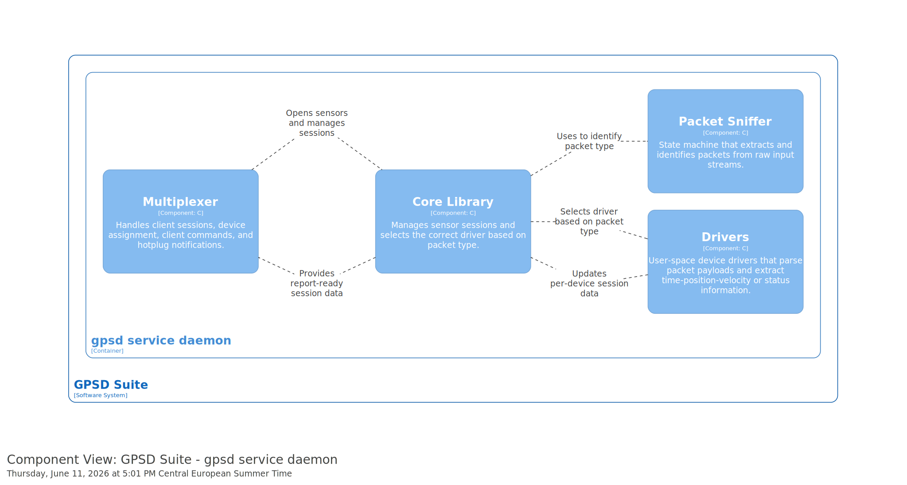

# GPSD Daemon Component View

This diagram shows the component-level architecture of the GPSD daemon.

The Component View gives more detail than the Container View. It focuses on the internal components of the GPSD daemon and shows how these components work together to process GPS data.

## Diagram

## Description

The GPSD daemon is the main background process of the GPSD system. It receives data from GPS devices, processes this data, and provides it to client applications.

This view helps to understand:

- which main components are inside the GPSD daemon
- how GPS data is received and processed
- how the daemon communicates with GPS devices
- how processed GPS data is provided to clients
- how the internal responsibilities of the daemon are separated

