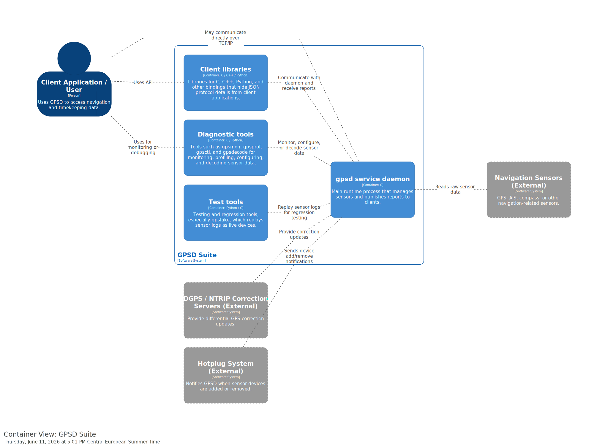

# Container View

This diagram shows the container-level architecture of the GPSD system.

The Container View describes the main parts of the system and how they communicate with each other.  
It gives more detail than the System Context diagram and focuses on the internal structure of the software system.

## Diagram

## Description

The GPSD system is divided into several containers that work together to receive, process, and provide GPS data.

This view helps to understand:

- which main containers are part of the system
- how the containers communicate with each other
- which external systems or users interact with the containers
- how GPS data flows through the system
