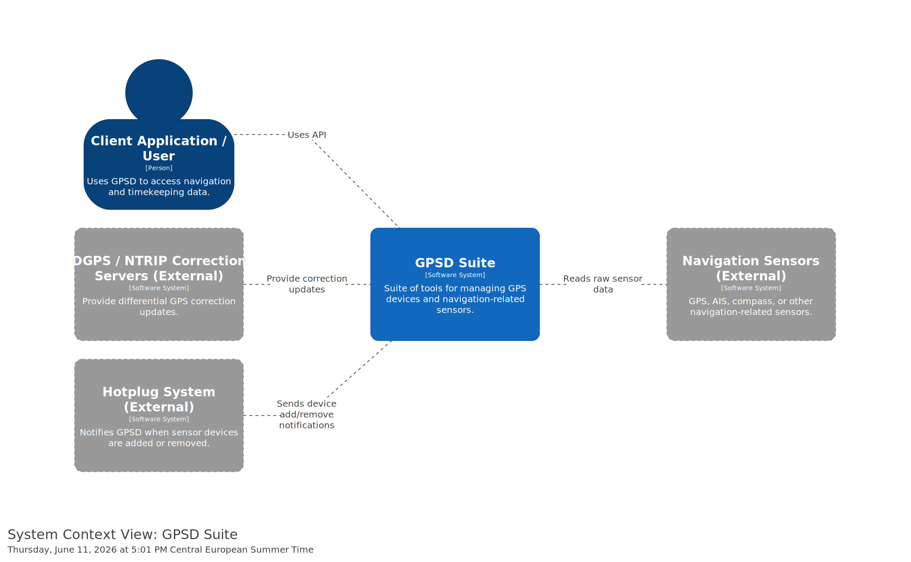

# System Context View

The System Context View is the highest-level C4 diagram. It shows the system as a whole and its relationship with external users, applications, devices, and systems.

## Diagram

## Purpose

The purpose of this diagram is to show the boundary of the GPSD system and how it interacts with its environment.

At this level, we do not show internal implementation details. Instead, the focus is on:

- who or what uses GPSD,
- which external systems GPSD interacts with,
- and what kind of communication happens between them.

## Main Elements

### GPSD Suite

GPSD is shown as the main software system. It provides a uniform interface for accessing navigation and sensor data.

### Client Application / User

Client applications or users interact with GPSD to receive navigation and timekeeping data.

### Navigation Sensors

Navigation sensors provide raw data to GPSD. These can include GPS devices, AIS receivers, digital compasses, or other navigation-related sensors.

### DGPS / NTRIP Correction Servers

Correction servers can provide differential GPS correction updates to improve positioning accuracy.

### Hotplug System

The hotplug system notifies GPSD when sensor devices are connected or removed.

## Interpretation

The diagram shows that GPSD acts as a mediator between client applications and navigation-related sensors.

Instead of requiring each client application to communicate directly with different devices and protocols, GPSD centralizes device communication and provides a more consistent interface for clients.